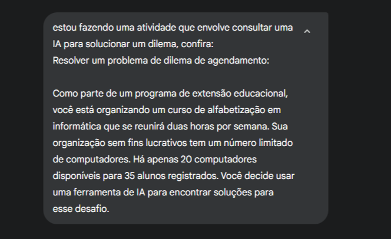
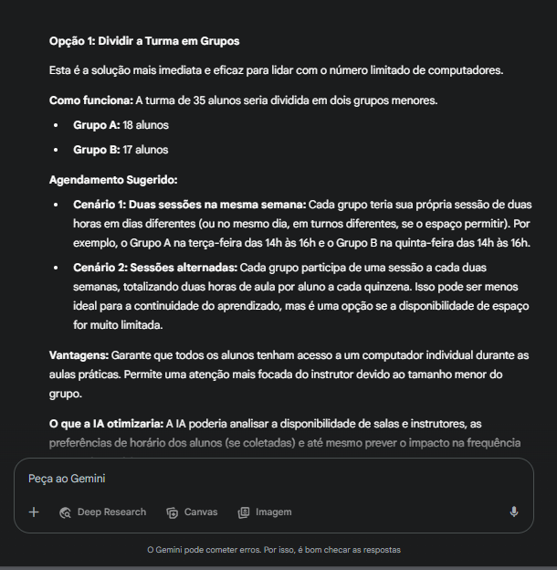
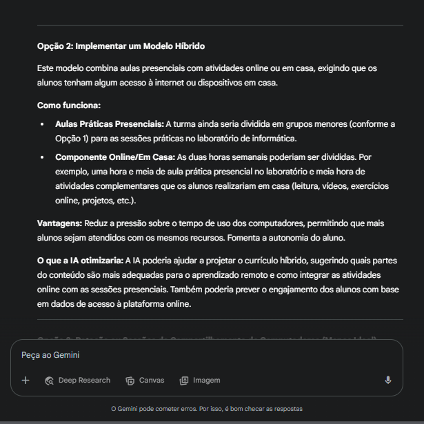
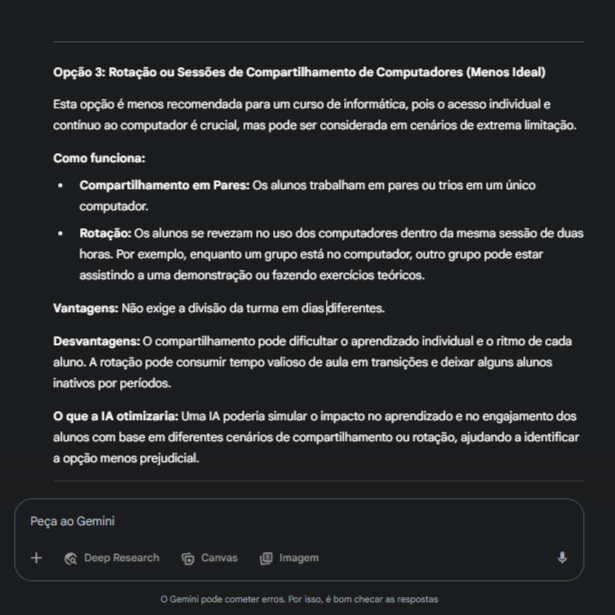
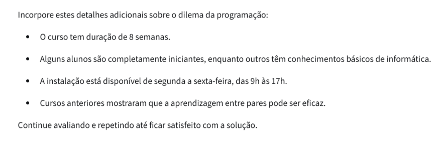
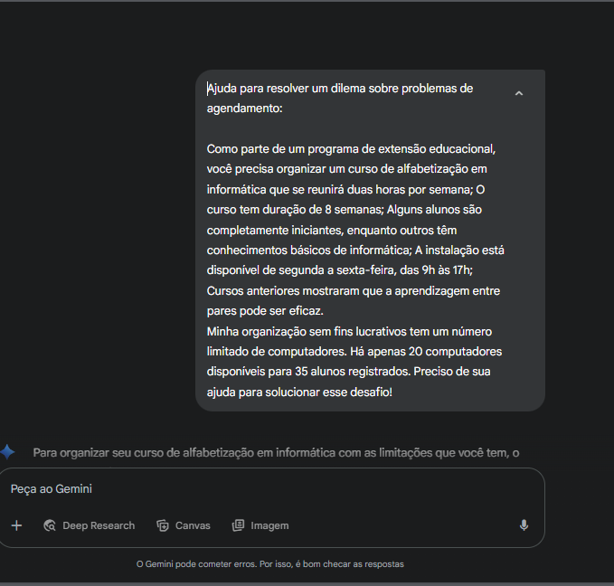
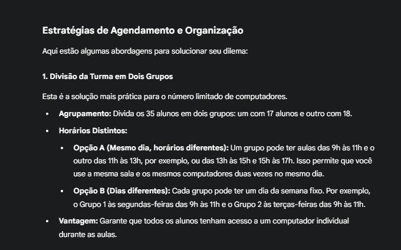
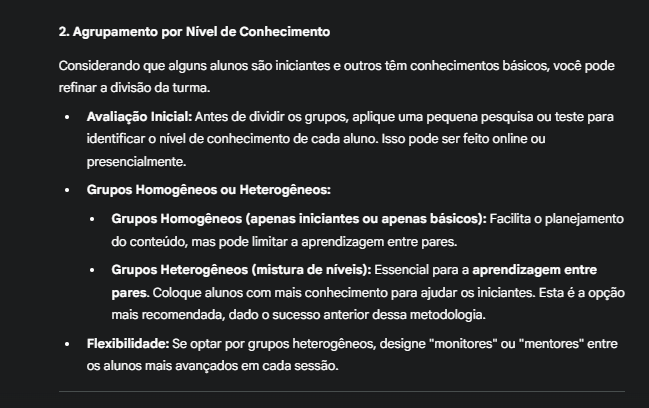
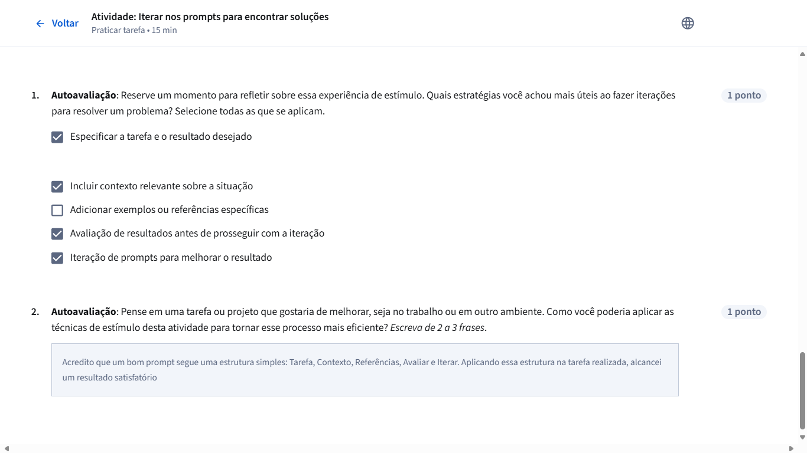

# 📘 Tarefa Documentada: Iterar nos Prompts para Encontrar Soluções  
### Caso aplicado: Agendamento de Curso com Limitação de Recursos

---

## 🎯 Descrição da Tarefa

Antes de iniciar esta atividade, foi revisada a estrutura ideal de um prompt:  
**Tarefa (incluindo Persona e Formato), Contexto, Referências, Avaliar e Iterar.**

A proposta era consultar uma IA para solucionar um dilema real, aplicando engenharia de prompts e avaliando criticamente os resultados.

---

## 🧩 Desafio Inicial

- 35 alunos registrados  
- Apenas 20 computadores disponíveis  
- Aulas com 2 horas semanais  
- Curso com duração de 8 semanas  
- Horário disponível: segunda a sexta, das 9h às 17h  
- Alunos com níveis variados de conhecimento (iniciantes e básicos)

---

## 🧠 Etapa 1: Prompt Inicial

**Prompt enviado à IA:**  
> "Estou fazendo uma atividade que envolve consultar uma IA para solucionar um dilema, confira:
Resolver um problema de dilema de agendamento:
Como parte de um programa de extensão educacional, você está organizando um curso de alfabetização em informática que se reunirá duas horas por semana. Sua organização sem fins lucrativos tem um número limitado de computadores. Há apenas 20 computadores disponíveis para 35 alunos registrados. Você decide usar uma ferramenta de IA para encontrar soluções para esse desafio."

  

---

## 📥 Primeira Resposta da IA (Resumo)

A IA apresentou três opções:

1. **Dividir a turma em grupos**  
2. **Modelo híbrido (presencial + online)**  
3. **Compartilhamento ou rotação de computadores**

         
         
      

---

## 🧐 Etapa 2: Avaliação Crítica da Primeira Resposta

Identifique as áreas em que o resultado poderia ser mais útil, específico ou melhor alinhado com suas necessidades. Pergunte a si mesmo:

1) As sugestões são práticas e acionáveis? Sim, as opções que eu acredito serem mais pertinentes e aplicáveis são a 1 e a opção 2.

2) A ferramenta de IA fez alguma suposição incorreta ou interpretou mal o contexto? Sim. Inicialmente quando eu contextualizei ela dizendo: "estou fazendo uma atividade que envolve consultar uma IA para solucionar um dilema" acredito que ela não entendeu que a IA da qual eu me referia era ele próprio e a questão envolvia questiona-lo diretamente para retornar apenas a solução para o problema e não necessariamente integrar uma IA à solução, gerando partes não tão importantes assim na saída/solução.

3) Quais fatores importantes não foram abordados? Acredito que todos os fatores foram abordados, inclusive aqueles que partiram de sua interpretação errônea.

4) Quais partes da resposta são mais úteis ou menos úteis? A menos útil no caso, opção 3, acho que não tinha necessidade de sugerir uma opção tão inadequada, além das opções que envolvem algum suporte de IA, acredito que integrar uma IA nas aulas como um explicador rápido para os alunos possa ser algo a acrescentar no projeto mas a abordagem que a IA seguiu não confere com esses parâmetros.

5) Que informações adicionais ajudariam a melhorar essas soluções? Prompts mais concisos e contextos mais claros, revisar a saída e iterar para melhorias, assim como estou fazendo, um processo cíclico onde o objetivo é sempre a melhoria.

---

## 🔁 Etapa 3: Iteração com Novo Prompt

**Prompt reformulado:**  
> "Ajuda para resolver um dilema sobre problemas de agendamento:
Como parte de um programa de extensão educacional, você precisa organizar um curso de alfabetização em informática que se reunirá duas horas por semana; O curso tem duração de 8 semanas; Alguns alunos são completamente iniciantes, enquanto outros têm conhecimentos básicos de informática;  A instalação está disponível de segunda a sexta-feira, das 9h às 17h; Cursos anteriores mostraram que a aprendizagem entre pares pode ser eficaz.
Minha organização sem fins lucrativos tem um número limitado de computadores. Há apenas 20 computadores disponíveis para 35 alunos registrados. Preciso de sua ajuda para solucionar esse desafio!"

---

## 📬 Nova Resposta da IA (Resumo)

A IA sugeriu:

- Divisão em dois grupos (17 e 18 alunos)  
- Agrupamento por nível de conhecimento  
- Avaliação diagnóstica inicial  
- Mentoria entre pares  
- Exemplo de agendamento coerente com o horário disponível

   

---

## ✅ Etapa Final: Avaliar o Novo Resultado

1. **As sugestões são práticas e acionáveis?** Sim  
2. **A IA fez alguma suposição incorreta?** Não  
3. **Faltou abordar algum fator importante?** Nenhum  
4. **Partes mais úteis?** A divisão em dois grupos e o agrupamento por nível de conhecimento.  
5. **Que informações adicionais ajudariam?** Nenhuma, o resultado foi satisfatório.  
6. **O que poderia ser melhorado?** Nada ficou por faltar nessa última saída.

---

## 🧠 Autoavaliação Final

### Quais estratégias foram mais úteis?
- ✅ Especificar a tarefa e o resultado desejado  
- ✅ Incluir contexto relevante sobre a situação  
- ✅ Avaliação de resultados antes de prosseguir com a iteração  
- ✅ Iteração de prompts para melhorar o resultado  

### Aplicação futura
> Acredito que um bom prompt segue uma estrutura simples: **Tarefa, Contexto, Referências, Avaliar e Iterar**. Aplicando essa estrutura na tarefa realizada, alcancei um resultado satisfatório.

---

📎 [Ver versão final com imagens (PDF)](https://github.com/JoshuaPortfolioXL/Projetos-e-Atividades-Realizadas/blob/main/agendamento-curso-ia/Iterar%20nos%20Prompts%20para%20Encontrar%20Solu%C3%A7%C3%B5es%20(1).pdf)
